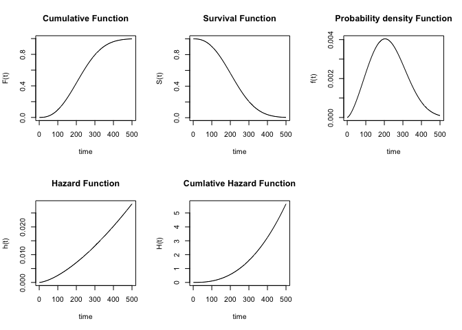

Test\_EDA
================

## R Markdown

``` r
op <- par(mfrow=c(2,3))
time <- 1:500

# p*():累積分布
Ft <- pweibull(time, shape = 2.5, scale = 250)
plot(time, Ft, type = 'l', ylab = 'F(t)', main = 'Cumulative Function')

# S(t) = 1 - F(t)
St <- 1 - Ft
plot(time, St, type = 'l', ylab = 'S(t)', main = 'Survival Function')

# d*():確率密度
ft <- dweibull(time, shape = 2.5, scale = 250)
plot(time, ft, type = 'l', ylab = 'f(t)', main = 'Probability density Function')

# 確率密度関数/生存関数=ハザード関数
ht <- ft/St
plot(time, ht, type = 'l', ylab = 'h(t)', main = 'Hazard Function')

# -Log(生存関数)=累積ハザード関数
Ht <- -1*log(St)
plot(time, Ht, type = 'l', ylab = 'H(t)', main = 'Cumlative Hazard Function')
```

<!-- -->

## math

with some more inline Latex *γ*, *λ*, *θ*

$$
sum\_{ i=1 }^{ n }i^{ 2 }=n(n+1)(2n+1)/6=\\frac { n(n+1)(2n+1) }{ 6 } 
$$

∏*i*<sup>4</sup> = ∫<sub>0</sub><sup>1</sup>*f*
